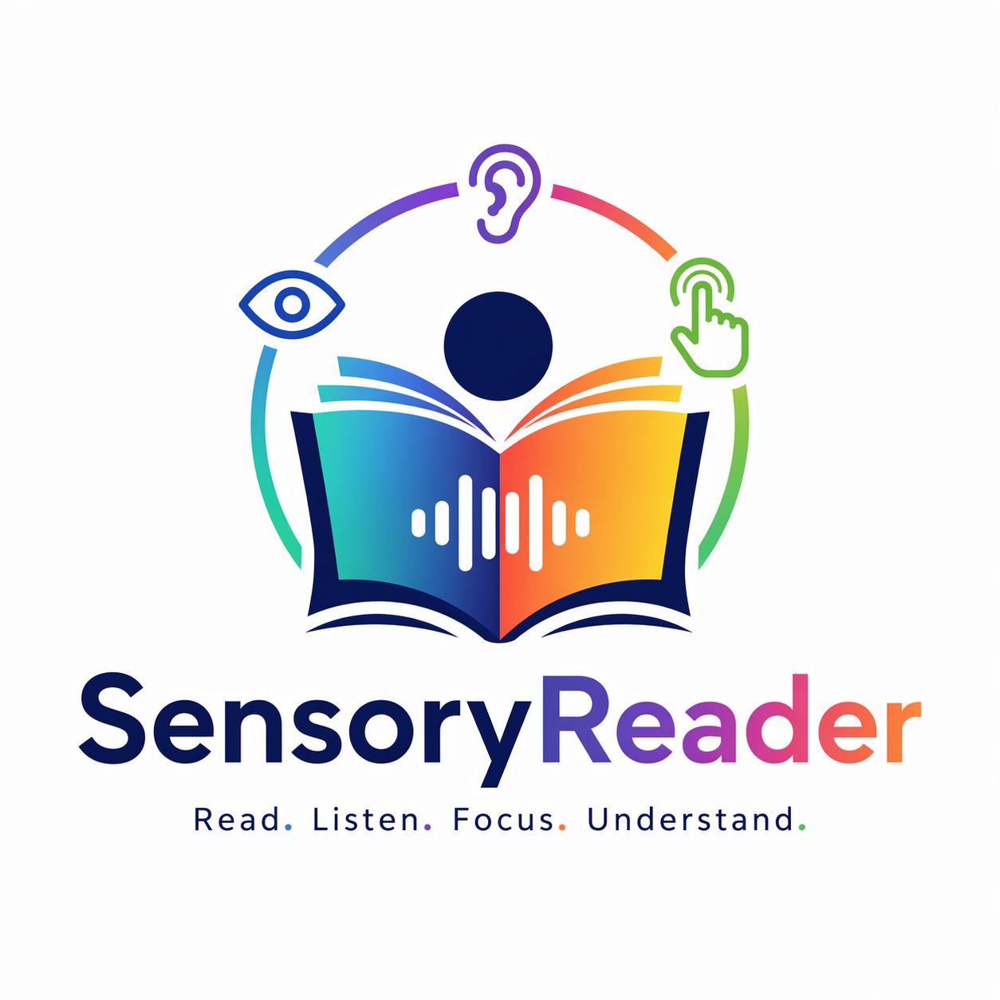
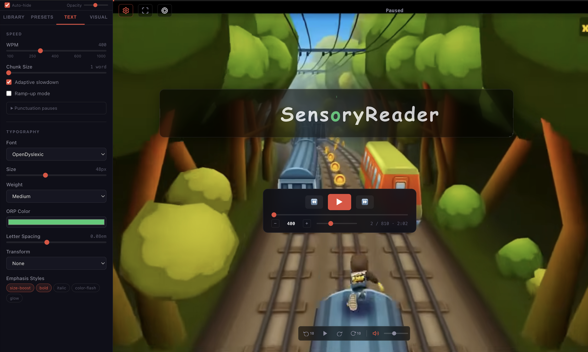
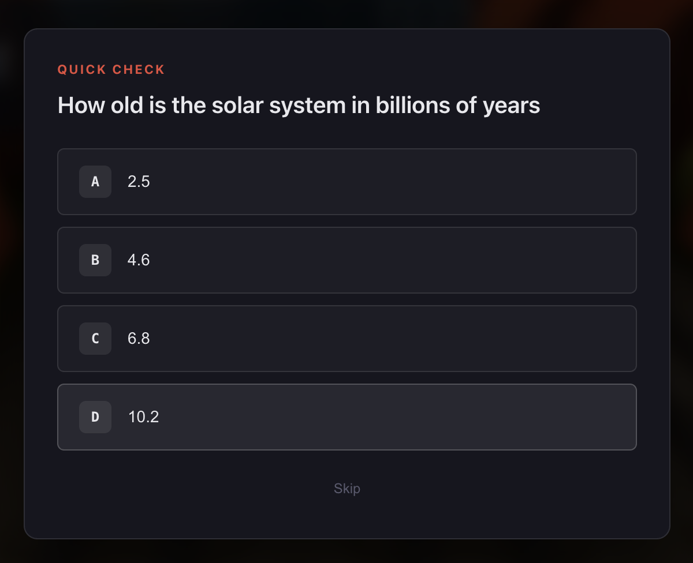
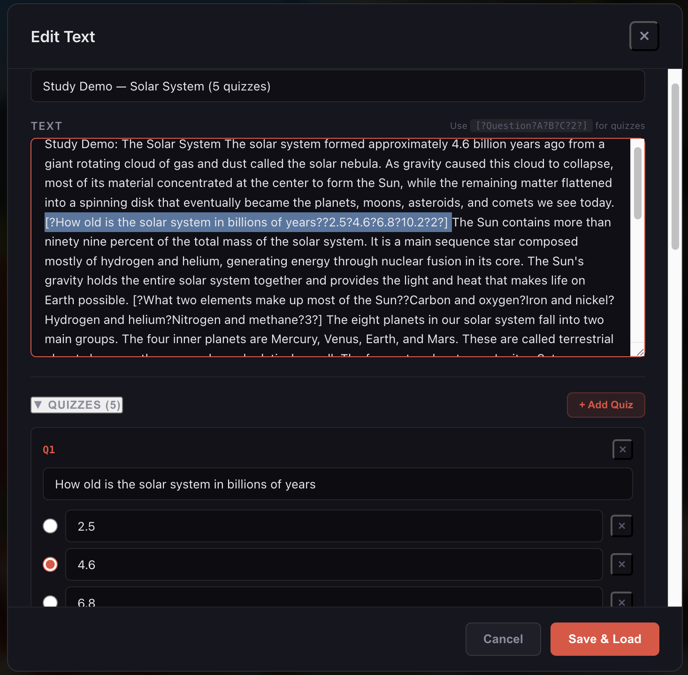

<p align="center">
  
</p>

<p align="center">
  <strong>Read at the speed of thought &middot; Test what you remember</strong><br/>
  <em>Speed reading with ORP alignment, inline comprehension quizzes, and webcam eye tracking</em>
</p>

<p align="center">
  
  
  
  
  
</p>

<p align="center">
  <a href="#quick-start">Quick Start</a> &middot;
  <a href="#features">Features</a> &middot;
  <a href="#eye-tracking-gaze-detection">Eye Tracking</a> &middot;
  <a href="#presets">Presets</a> &middot;
  <a href="#keyboard-shortcuts">Shortcuts</a> &middot;
  <a href="#standalone-version">Standalone</a> &middot;
  <a href="#architecture">Architecture</a>
</p>

---

<p align="center">
  
</p>

<p align="center"><sub>
  ORP-aligned word display &middot; draggable marquee &middot; YouTube ambient background &middot; webcam eye tracking &middot; customizable settings panel
</sub></p>

---

## What is it?

**SensoryReader** flashes one word at a time in a fixed focal zone, with the **Optimal Recognition Point** (the slight left-of-center pivot character) highlighted in color. Because the pivot always lands at the same screen pixel, your eyes never need to move -- they just *recognize*. The result is faster reading with less fatigue.

### Eye tracking that keeps you honest

Enable the **webcam eye tracker** and SensoryReader will **pause playback when you look away** and resume when you look back. It uses MediaPipe's face landmark model to track your iris position in real time &mdash; no special hardware, no calibration required (though optional 5-point calibration improves accuracy). A live debug panel shows your gaze direction, face detection, and FPS.

### Active reading with inline quizzes

Reading fast is only useful if you remember what you read. SensoryReader supports **interactive comprehension quizzes** that you embed directly inside your text using a simple inline marker:

```
The solar system formed 4.6 billion years ago. [?How old is the solar system??2.5?4.6?6.8?10.2?2?]
```

When the reader hits a marker, **playback pauses**, a multiple-choice quiz pops up, and resumes automatically after you answer. The progress bar shows tick marks for every quiz so you can see them coming -- the next upcoming one pulses yellow.

<p align="center">
  
</p>

<p align="center"><sub>
  <strong>Quiz pop-up.</strong> Multiple-choice question with green/red feedback, auto-dismissing 1.5s after you answer.
</sub></p>

Toggle testing on or off with one click in the toolbar, or use the **built-in editor** (pencil icon) to add and edit quizzes via a friendly form &mdash; no need to type the marker syntax by hand.

<p align="center">
  
</p>

<p align="center"><sub>
  <strong>Built-in editor.</strong> Edit the loaded text and manage its quizzes through a form. Add or remove options, mark the correct answer with a radio button, delete or append questions, then save to reload.
</sub></p>

Try the **Study preset** with the included Study Demo for a 5-question solar-system walkthrough.

### Playful by design

It also happens to be a pretty playful environment to read in. Drop a YouTube video in the background, drag the text panel where you want it, pick a star-shaped marquee if you feel like it, and tune everything from chunk size to backdrop blur.

Two builds in one repo:

| | Full app | Standalone |
|---|---|---|
| **Stack** | React 19 + TypeScript + Vite | Vanilla HTML/CSS/JS |
| **Best for** | Desktop power users | Tablets, phones, offline use |
| **Install** | `npm install` | None -- open the file |
| **Bundle** | ~75 KB gzip | Single ~40 KB HTML file |
| **PDF support** | Yes (pdf.js) | No (TXT/MD only) |
| **Eye tracking** | Yes (webcam) | No |
| **Drag & resize UI** | Yes | No |
| **Touch optimized** | Works | Optimized |

Everything runs in your browser. No backend, no telemetry, no accounts.

---

## Quick Start

### Full app

```bash
git clone https://github.com/jbx99/SensoryReader.git
cd SensoryReader
npm install
npm run dev
```

Open [http://localhost:5173/](http://localhost:5173/). The app loads with a Welcome guide that walks you through every feature -- press <kbd>Space</kbd> to begin.

### Standalone (zero install)

Open `standalone.html` directly in any browser, or visit [http://localhost:5173/standalone.html](http://localhost:5173/standalone.html) when the dev server is running.

### Production build

```bash
npm run build      # outputs to dist/
npm run preview    # serve the built version locally
```

---

## Features

### Reading engine

- **ORP alignment** &mdash; pivot character locked to a fixed screen pixel for every word
- **WPM 100&ndash;1000** &mdash; slider, +/- buttons, and arrow keys all stay in sync
- **Chunk mode** &mdash; show 1, 2, or 3 words at a time, ORP-balanced for any chunk size
- **Adaptive slowdown** &mdash; auto-pause longer on words 7+ characters
- **Punctuation pauses** &mdash; per-mark multipliers (commas, periods, dashes, etc.)
- **Ramp-up mode** &mdash; ease in 20% slower, accelerate to target over 10 seconds
- **Emphasis detection** &mdash; long words, proper nouns, and post-colon words can flash, glow, bold, or grow

### Input sources

- **Paste** any text directly
- **Drag & drop** PDF, TXT, or MD files (PDF parsing preserves line structure)
- **URL fetch** with Vite dev proxy for CORS handling
- **Sample library** &mdash; 10 classic Project Gutenberg texts (Meditations, Letters from a Stoic, The Prince, etc.) plus a built-in Welcome guide and a Study Demo with embedded quizzes
- **Recent history** &mdash; resume saved positions with cached text
- **Built-in editor** &mdash; click the pencil icon in the toolbar to edit any loaded text or its embedded quizzes inline

### Display & layout

- **Draggable, resizable text marquee** &mdash; click anywhere on the panel to drag, grab edges to resize
- **Draggable playback controls** &mdash; move the transport bar wherever you like
- **Five panel shapes** &mdash; None, Rectangle, Pill, Circle, or Star (CSS clip-path)
- **Configurable text background** &mdash; color, opacity, backdrop blur
- **Independent text & panel opacity** &mdash; fade text or background separately
- **Optional reading guide line** at the focal point
- **Progress display** &mdash; bar, dot, or hidden

### Backgrounds

- **Solid color** &mdash; color picker
- **Image upload** &mdash; with blur and brightness controls
- **YouTube ambient video** &mdash; paste any URL or video ID. Includes a draggable on-screen control strip with play/pause, &plusmn;10s seek, restart, mute toggle, and volume slider. The iframe is scaled to hide YouTube chrome.
- **Tinted overlay** &mdash; configurable color and opacity layered between the background and text

### Settings panel

A collapsible left sidebar with **four tabs**:

| Tab | What's in it |
|---|---|
| **Library** | Paste, upload, URL fetch, sample library, recent history |
| **Presets** | Switch, rename, save, duplicate, export, import, delete |
| **Text** | Speed (WPM, chunk, slowdown, ramp-up, punctuation) + Typography (font, size, weight, ORP color, letter spacing, transform, emphasis) |
| **Visual** | Background mode, overlay, screen mode, panel shape and opacity, progress style, guide line, text opacity, text background, gaze detection |

The panel slides over the reader as a transparent overlay (the background doesn't resize). It has an **opacity slider** and an **auto-hide** toggle that closes it on playback start.

### Playback controls

- Play/Pause, Rewind 5s, Skip sentence
- Position scrubber, WPM slider, &plusmn;25 nudge buttons
- Live word count and time remaining
- Auto-hide after 3s idle, hover edges to bring back

### Screen modes

- **Windowed** &mdash; default
- **Fullscreen** &mdash; browser Fullscreen API, synced both ways
- **Focus strip** &mdash; constrains the reader to a 180px horizontal band

### Screen recording for social clips

Built-in screen recorder captures **15s, 30s, or 60s** clips of your reading session with a 3-2-1 countdown, pulsing red indicator, and one-click download. Outputs MP4 (H.264) where supported, WebM otherwise -- both formats embed natively in GitHub READMEs and social media posts.

### Interactive testing (comprehension quizzes)

Embed pop-quiz questions directly inside your text using a simple inline marker. The reader pauses when it reaches a marker, displays a multiple-choice modal, reveals the correct answer with green/red feedback, and resumes automatically. (See screenshots in the [intro section above](#active-reading-with-inline-quizzes).)

**Marker format:**

```
[?Question text?Option A?Option B?Option C?2?]
```

The trailing number (1-based) is the index of the correct answer. 2-4 options supported.

**Features:**

- **Toggle on/off** &mdash; graduation cap button in the toolbar, or the Visual settings tab
- **Visual cue on the progress bar** &mdash; small tick marks show where every quiz lives in the document. The next upcoming quiz pulses yellow so you know one is approaching. Passed quizzes turn green.
- **Same cue on the playback scrubber** &mdash; quiz tick marks appear on both the top progress bar and the bottom transport scrubber
- **Skip mode** &mdash; when testing is disabled, the reader silently skips over markers as if they weren't there
- **Built-in editor** &mdash; the pencil icon in the toolbar opens a modal where you can edit text and manage quizzes via a friendly form (no need to type the marker syntax by hand). Add, delete, edit options, mark the correct answer, and save back to the loaded document.
- **Auto-dismiss** &mdash; the quiz modal fades out 1.5s after you answer, then playback resumes

**Try it:** load the **Study Demo** sample (5 questions about the solar system) from the Library tab and switch to the **Study preset** for the full experience.

### Eye tracking (gaze detection)

SensoryReader can use your webcam to track your eyes and **automatically pause playback when you look away**. No special hardware required &mdash; just a standard laptop webcam.

**How it works:**

- Uses **MediaPipe FaceLandmarker** (loaded from CDN on demand) to detect 468 face landmarks including iris positions
- Computes gaze direction (center, left, right, up, down) by measuring iris position relative to eye corners
- Detects eye closedness via eye aspect ratio
- GPU-accelerated via WebGL for smooth real-time performance

**Features:**

- **Toggle on/off** &mdash; eye icon in the toolbar, or the Visual settings tab
- **Calibration-free mode** &mdash; works out of the box with sensible defaults
- **5-point calibration** &mdash; look at dots at center, left, right, top, and bottom to personalize thresholds for your face and camera position. Guided or manual mode. Calibration is saved to `localStorage`.
- **Auto-pause with tolerance** &mdash; configurable delay (200&ndash;2000ms) before pausing on lost gaze, preventing false triggers from blinks or brief glances
- **Smart resume** &mdash; only auto-resumes if it was gaze detection that paused playback; manual pauses are respected
- **Live debug panel** &mdash; draggable overlay showing camera preview with face bounding box, gaze reticle, iris offsets (raw and calibrated), eye openness, FPS, and contextual tips
- **Toolbar indicator** &mdash; green dot (gaze detected), red pulsing dot (gaze lost), yellow (initializing), or error icon. Click to open the debug panel.
- **Clear recent history** &mdash; trash icon in the toolbar to clear recent document history

### Persistence

Saved to `localStorage`:

- Per-document reading position (keyed by content hash)
- Custom presets
- Recent document history (up to 20) with cached text (up to 5)
- Eye tracking calibration data
- Usage stats (total words read, average WPM, sessions)

---

## Presets

Eight built-in presets, each fully customizable:

| Preset | WPM | Vibe |
|---|---|---|
| **Welcome** | 250 | Tutorial mode with YouTube background and ramp-up |
| **Focus** | 300 | Calm Georgia serif on dark blue, gentle pauses |
| **Sprint** | 600 | Stripped-down sans-serif, no emphasis, dot progress |
| **Cinematic** | 250 | Bold 64px text, video background, pill panel |
| **Dyslexia-friendly** | 260 | OpenDyslexic, wide letter spacing, green highlight |
| **Night Mode** | 300 | Warm amber tones, dark background |
| **Study** | 250 | Atkinson Hyperlegible, blue ORP, dark teal background, **interactive testing on** |
| **Custom** | 300 | Blank slate to build your own |

You can **rename** any preset (built-in or custom), **save** current settings over a custom preset, **duplicate**, **export as JSON**, **import** shared presets, and **delete** custom ones.

---

## Keyboard Shortcuts

| Key | Action |
|:---:|---|
| <kbd>Space</kbd> | Play / Pause |
| <kbd>&larr;</kbd> | Rewind 5 seconds |
| <kbd>&rarr;</kbd> | Skip to next sentence |
| <kbd>&uarr;</kbd> / <kbd>+</kbd> | +25 WPM |
| <kbd>&darr;</kbd> / <kbd>-</kbd> | &minus;25 WPM |
| <kbd>F</kbd> | Toggle fullscreen |
| <kbd>Esc</kbd> | Toggle settings panel |

---

## Standalone Version

`standalone.html` is a single self-contained HTML file -- **no build, no server, no install**. Open it in any browser (or copy it to a tablet) and you're reading.

Optimized for **touch**:

- **44px+ touch targets** everywhere
- **Tap the marquee** to play/pause
- **Bottom-sheet settings drawer** &mdash; slides up, swipe down to close
- **Safe area insets** for iPhone notch and iPad home bar
- **6px sliders** built for thumbs
- **CORS proxy fallback** for fetching Gutenberg samples offline-friendly

Includes everything from the full app **except** PDF support, drag/resize UI, and image backgrounds.

---

## Tech Stack

**Full app**

- **React 19** + **TypeScript**
- **Vite 8** (dev server with proxies for CORS-restricted sources)
- **pdfjs-dist** for PDF text extraction (worker bundled locally via `?url` import &mdash; no CDN)
- **@mediapipe/tasks-vision** for eye tracking (FaceLandmarker, loaded from CDN on demand &mdash; not bundled)
- **No state management library** &mdash; just `useRef`, `useState`, and `useCallback`
- **No CSS framework** &mdash; CSS custom properties and vanilla CSS
- **No backend** &mdash; everything runs client-side

**Standalone**

- Vanilla HTML, CSS, and JavaScript
- Zero dependencies
- Single file (~40 KB)
- Uses native `MediaRecorder`, `getDisplayMedia`, and `Fullscreen` APIs

---

## Architecture

### Project structure

```
SensoryReader/
├─ standalone.html              -- single-file touch version
├─ public/
│  ├─ logo.svg
│  └─ favicon.svg
├─ src/
│  ├─ engine/
│  │  ├─ orp.ts                 -- ORP pivot calculation (pure)
│  │  ├─ tokenizer.ts           -- word/sentence/emphasis tokens
│  │  ├─ timing.ts              -- delay math (pure)
│  │  └─ testParser.ts          -- inline quiz marker parser
│  ├─ hooks/
│  │  ├─ useReaderEngine.ts     -- core playback loop (ref-based timer)
│  │  ├─ useGazeDetection.ts    -- eye tracking with MediaPipe FaceLandmarker
│  │  ├─ useScreenRecorder.ts   -- MediaRecorder wrapper
│  │  ├─ useKeyboard.ts         -- keyboard shortcut bindings
│  │  ├─ useLocalStorage.ts     -- typed localStorage hook
│  │  ├─ usePersistence.ts      -- positions, stats, presets
│  │  └─ useFullscreen.ts       -- Fullscreen API wrapper
│  ├─ presets/
│  │  ├─ defaults.ts            -- 7 built-in presets
│  │  └─ presetsManager.ts      -- CRUD + import/export
│  ├─ input/
│  │  ├─ parseText.ts           -- cleaning + content hash (djb2)
│  │  ├─ parsePdf.ts            -- pdf.js extraction
│  │  ├─ fetchUrl.ts            -- article extraction
│  │  └─ recentHistory.ts       -- history + text cache
│  ├─ data/
│  │  ├─ sampleLibrary.ts       -- Gutenberg sample manifest
│  │  ├─ welcomeText.ts         -- built-in tutorial text
│  │  └─ studyDemoText.ts       -- 5-question solar system demo
│  ├─ components/
│  │  ├─ App.tsx
│  │  ├─ ReaderDisplay.tsx      -- ORP-aligned word rendering
│  │  ├─ PlaybackControls.tsx
│  │  ├─ BackgroundEngine.tsx   -- solid/image/YouTube + overlay
│  │  ├─ ConfigPanel.tsx        -- left sidebar
│  │  ├─ InputPanel.tsx         -- library tab content
│  │  ├─ ProgressIndicator.tsx
│  │  ├─ DraggableBox.tsx       -- drag/resize wrapper
│  │  ├─ RecordButton.tsx       -- screen recorder UI
│  │  ├─ QuizModal.tsx          -- pop quiz multiple-choice modal
│  │  ├─ EditTextModal.tsx      -- inline text and quiz editor
│  │  ├─ GazeDebugPanel.tsx     -- draggable eye tracking debug overlay
│  │  └─ GazeCalibration.tsx    -- fullscreen 5-point calibration UI
│  ├─ types/index.ts
│  └─ styles/index.css
└─ content/
   ├─ Screenshot.png
   └─ stoic_library/            -- sample text stubs with Gutenberg links
```

### Design decisions

- **Timer in `useRef`, not state.** The playback loop stores `currentIndex` in a ref and only re-renders React on chunk change. This prevents jitter above 600 WPM.
- **Config in a ref too.** WPM changes mid-playback read from a config ref each tick, so adjustments take effect immediately without restarting the timer. The engine propagates changes back to React state via a callback so every UI control stays synchronized.
- **Pure engine functions.** `orp.ts`, `tokenizer.ts`, and `timing.ts` have zero React dependencies and are independently testable.
- **One `ReaderConfig` object.** Every visual and behavioral setting lives in one typed object. Presets serialize and restore the object directly &mdash; no migration logic.
- **Drag passes through interactive children.** The DraggableBox uses `el.closest()` to detect clicks on buttons, sliders, and SVG icons so they remain interactive during drag.
- **Pointer-events layering.** Content layers use `pointer-events: none` with `auto` on direct children, so clicks pass through empty space to the YouTube iframe underneath while UI elements stay interactive.
- **Sidebar opacity via pseudo-element.** A `::before` element holds the background with `opacity` controlled by a CSS variable, keeping text fully readable at any transparency level.
- **Sentinel positioning.** `DraggableBox` accepts `-1` (center), `-2` (bottom-right), and `-3` (center-x, below-center-y) as initial coordinates, resolved to pixels on first render.
- **Eye tracking via CDN import.** MediaPipe FaceLandmarker (~5 MB) is loaded with a dynamic `import()` from jsDelivr CDN only when the user enables gaze detection. This keeps the initial bundle small and avoids Vite/WASM bundling issues. The `@vite-ignore` directive prevents Vite from trying to resolve the URL.
- **Calibration normalizes iris ratios.** Raw iris position relative to eye corners varies per person and camera angle. The 5-point calibration captures the user's natural center offset and movement range, then normalizes all readings so "1.0" means "at the edge of your screen" regardless of face geometry. Calibration data persists in `localStorage`.
- **Sidebar as overlay.** The settings panel is positioned absolutely and slides over the reader content, so the background never resizes when the panel opens or closes.

---

## Contributing

This is a personal project built for fun, but issues and pull requests are welcome. If you want to add a feature:

1. Open an issue first to discuss the idea
2. Fork the repo
3. Add your feature in a new branch
4. Open a pull request

Built by exploring, breaking, and rebuilding. Have fun with it.

---

## License

MIT
